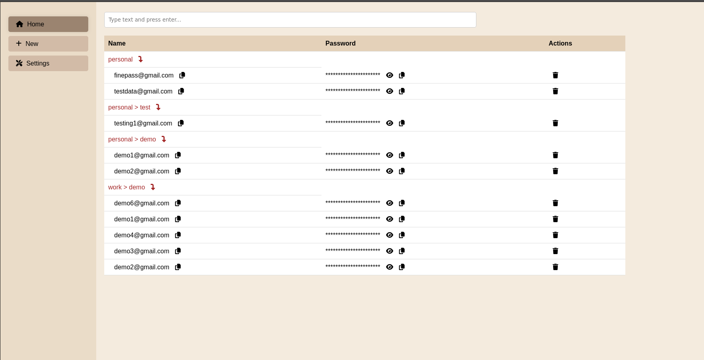

# passage-webui 
- Simple password manager which is both developer and user friendly.
- The project is handled using `uv` (https://docs.astral.sh/uv)
- Uses age encryption for encrypt/decrypt files
- Built on the top of the passage shell script

## Run the project
- Run the project by executing `setup.sh` file

## Built on the using of
- [Passage](https://github.com/FiloSottile/passage)
- HTMX
- FastAPI
- FontAwesome

## Screenshots

## Reference blog, link for the projects
- How to send html file from fast api
  - https://stackoverflow.com/questions/65916537/a-minimal-fastapi-example-loading-index-html
- HTMX: https://htmx.org/

